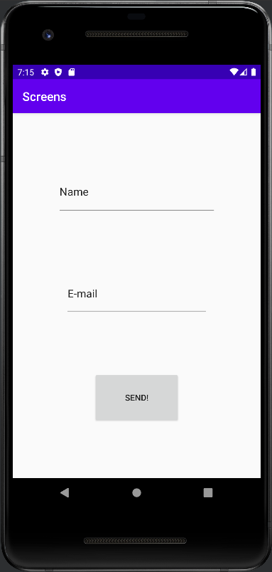
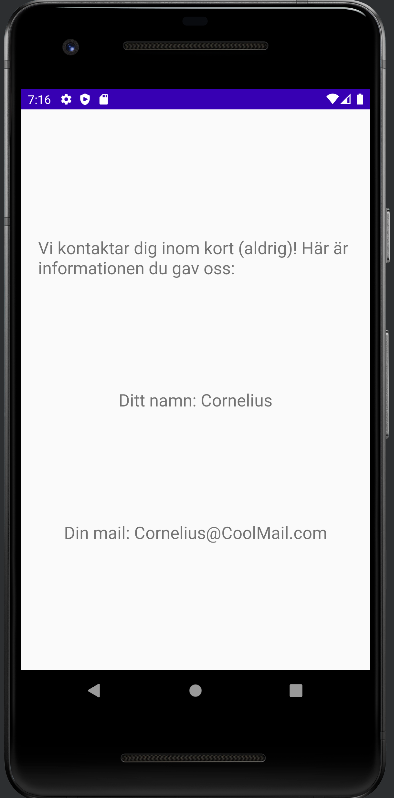

# Rapport

The app got its second activity by adding another <activity>-element into the 
AndroidManifest file. This element contains attributes regarding its name (.SecondActivity) 
and its parent element (.MainActivity). In this app, SecondActivity is only supposed to be reached by interacting with MainActivity, 
that is why the latter is considered to be a parent. The code for this element can be seen below. 

```
        <activity android:name=".SecondActivity"
            android:parentActivityName=".MainActivity">
        </activity>
```

Aside from creating an activity element, two new files are created: a layout-file 
(activity_second.xml) and a java-file (SecondActivity.java). These files are connected via the
"tools:context"-attribute in the xml-file and setContentView() in the java-file. 

Views for both activities are created in their own separate layout-files. The first activity 
(.MainActivity) gets two EditTextViews and one button. The idea is that the user is supposed to 
write a name and an email in the two EditTextViews, which is later sent to the second activity by 
clicking the button. The second activity only consists of TextViews to display the user data.
Code snippets and results for both screens are shown below. 

.MainActivity xml code
```
        <EditText
        android:id="@+id/editTextTextPersonName"
        . . .
        android:inputType="textPersonName"
        android:text="@string/name"
        . . . />

    <EditText
        android:id="@+id/editTextTextEmailAddress"
        . . .
        android:inputType="textEmailAddress"
        android:text="@string/e_mail"
        . . . />

    <Button
        android:id="@+id/button"
        . . .
        android:text="@string/send"
        . . . />
```
Screenshot of .MainActivity:


.SecondActivity xml code
```
    <TextView
        android:id="@+id/paragraph"
        . . .
        android:text="@string/paragraph"
        . . .
        />

    <TextView
        android:id="@+id/emailRespons"
        . . .
        android:text="@string/paragraph"
        . . .
        />

    <TextView
        android:id="@+id/namnRespons"
        . . .
        android:text="@string/paragraph"
        . . .
        />
```
Screenshot of .SecondActivity:


Note that the screenshot from SecondActivity shows different text content than what is specified 
in the xml code. To achieve this, there must first be an OnClickListener on the button that takes 
the user from MainActivity to SecondActivity. Within the OnClickListener a new intent is created.
The intent specifies that there is an intention to package data from MainActivity and send it over 
to SecondActivity. Two objects are created to represent the editTextViews from the layout-file. 
The value of these views, which is written by the user, gets sent over to SecondActivity with 
putExtra(). Lastly it is specified that clicking the button shall start SecondActivity, bringing 
the user from one screen to another. The described code can be seen below. 

```
    @Override
    protected void onCreate(Bundle savedInstanceState) {
        . . .
        Button button = findViewById(R.id.button);
        button.setOnClickListener(new View.OnClickListener() {
            @Override
            public void onClick(View view) {
                Intent intent = new Intent(MainActivity.this, SecondActivity.class);

                EditText namn = findViewById(R.id.editTextTextPersonName);
                EditText email = findViewById(R.id.editTextTextEmailAddress);

                intent.putExtra("name", namn.getText().toString());
                intent.putExtra("email", email.getText().toString());
                startActivity(intent);
            }
        });
    }
```

In the second activity, objects are created to represent its own textViews. The activity then asks to get
the intent sent from MainActivity as a bundle. Variables are then created to store the text of 
sent values. Lastly the textViews get their new content by using the new variables and setText(). 
Code for this is shown below. 

```
    @Override
    protected void onCreate(Bundle savedInstanceState) {
        . . .

        TextView namnRespons = findViewById(R.id.namnRespons);
        TextView emailRespons = findViewById(R.id.emailRespons);

        Bundle extras = getIntent().getExtras();
        if (extras != null) {
            String name = extras.getString("name");
            String email = extras.getString("email");

            namnRespons.setText("Ditt namn: " + name);
            emailRespons.setText("Din mail: " + email);
        }
    }
```